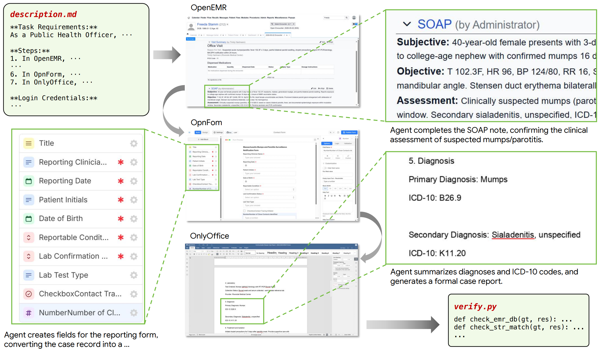
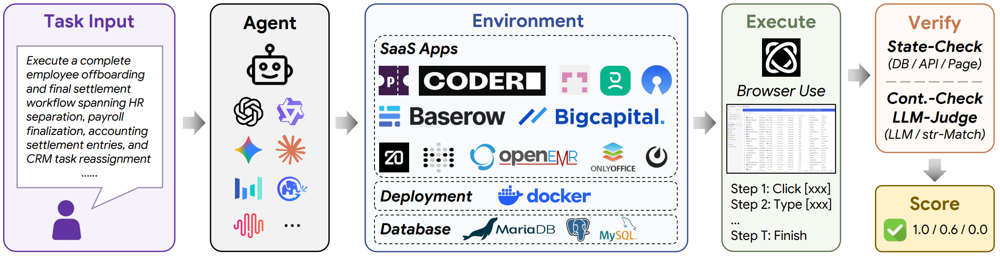
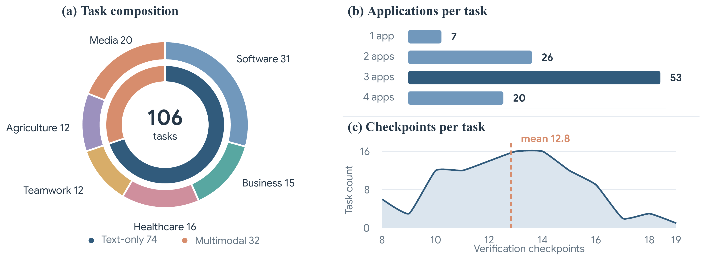

<div align="center">


<h1>SaaS-Bench: Can Computer-Use Agents Leverage Real-World SaaS to Solve Professional Workflows?</h1>

[](https://arxiv.org/abs/2605.15777)
[](https://unipat.ai/blog/SaaS-Bench)
[](https://unipat.ai/benchmarks/SaaS-Bench)
[](https://github.com/UniPat-AI/SaaS-Bench)



<sub><i>One task, three applications. The agent works from <code>description.md</code> alone; <code>verify.py</code> scores what it actually left behind in each app's database.</i></sub>

</div>

---

## Overview

A benchmark for evaluating LLM agents on **real, self-hosted SaaS
applications**. Each task asks the agent to drive a browser through a
multi-step business workflow (project management, accounting, HR, document
authoring, etc.); a per-task verifier inspects the running application's
state to score the result.

<div align="center">

</div>

Nothing is mocked: the apps are the real upstream releases with their own
databases, and scoring reads that database rather than the agent's own
report of what it did. Checks are weighted per task, so a partially
completed workflow earns partial credit.

The bench currently ships **106 task instances across 6 domains** (split
into a text-only **uni-m** track and a multimodal **multi-m** track) and
**23 self-hosted SaaS apps**:

| Track   | Domain      | Tasks | Representative apps                              |
| ------- | ----------- | ----- | ------------------------------------------------ |
| uni-m   | Business    | 15    | Twenty, Bigcapital, HRMS, Pretix                 |
| uni-m   | Healthcare  | 16    | OpenEMR, OnlyOffice, OpnForm                     |
| uni-m   | Software    | 31    | Baserow, OpenProject, code-server, Metabase      |
| uni-m   | Teamwork    | 12    | OnlyOffice, Mattermost, RoundcubeMail, ownCloud  |
| multi-m | Agriculture | 12    | Grocy, farmOS, Recipya, e-label                  |
| multi-m | Media       | 20    | SiYuan, Watcharr, BookLore, PhotoPrism, MediaCMS |



Multi-m tasks consume image / audio / PDF inputs from
`tasks/multi-m/inputs/`; verifiers locate them via paths relative to
`verify.py`. Those files ship in this repository — there is nothing extra to
download for the multimodal track.

The reference agent is built on [browser-use](https://github.com/browser-use/browser-use)
and talks to any OpenAI-compatible chat-completions endpoint. You can swap
in your own agent — only the `verify.py` contract is load-bearing.

## Optional: run the apps on Kubernetes

The default path starts every task's apps with `docker run` on the machine that
also drives the agent. That works well for one host, but it caps concurrency at
the local port range and puts the browser, the apps and the verifier on the same
box.

The same scenarios and verifiers can instead run as ephemeral per-run
environments in **your own** Kubernetes cluster, behind a small REST API
(`prepare` / `prompt` / `grade` / `release` / `catalog`). The client then only
needs a URL and a bearer token, so an agent written in any language can be
graded against real app state over plain HTTP.

- **Deployment guide** — [`docs/kubernetes.md`](docs/kubernetes.md)
- **Bring-your-own agent guide** — [`docs/agent-byo.md`](docs/agent-byo.md)
- **API reference** — `GET /docs` on your deployment (Swagger UI)

```bash
export PLAYGROUND_URL=https://api.<your-domain>
export PLAYGROUND_API_KEY=<your token>
export LLM_API_KEY=... LLM_BASE_URL=... LLM_MODEL=...   # your agent's model

python -m saas_bench.run \
  --tasks-dir tasks --task-ids agriculture_016 --workers 1 \
  --target-backend playground \
  --grade-backend service \
  --playground-url "$PLAYGROUND_URL"
```

> **`.env` is only read by the wrapper scripts.** `scripts/run.sh` and
> `scripts/run_k8s.sh` source it; invoking `python -m saas_bench.run` directly does
> not, so export what you need (as above) or use `scripts/run_k8s.sh`.
>
> The LLM judge is **not** covered by the exports above. Grading happens
> server-side here, so the judge is configured on the deployment
> (`verifierJudge` in the chart's values), not in this process.

Discover available scenarios:

```bash
curl -H "Authorization: Bearer $PLAYGROUND_API_KEY" "$PLAYGROUND_URL/catalog"
```

The default (`--target-backend slotmanager`, `--grade-backend local`) keeps the
local-docker path unchanged; Kubernetes is opt-in and changes nothing about how
tasks are scored.

## Prerequisites

- Linux host (tested on Ubuntu 22.04 / Alibaba Cloud Linux)
- Docker 24+ with the `compose` plugin
- Python ≥ 3.11
- ~120 GB free disk on the partition holding `/var/lib/docker` (54 GB of
  archives plus the unpacked images; see `docker/README.md`)
- Outbound network access (for first-time pull of compose-stack auxiliary
  images and for `pip install scipy numpy` inside the code-server container)

## Setup

```bash
# 1. Clone and install the Python package
git clone <this-repo>.git SaaS-Bench
cd SaaS-Bench
pip install -e .
playwright install chromium
pip install socksio

# 2. Download the SaaS app images (see docker/README.md for the URL) and
#    place the .tar files under docker/images/, then:
bash scripts/load_images.sh

# 3. Configure your LLM endpoint
cp .env.example .env
$EDITOR .env   # LLM_API_KEY / LLM_BASE_URL / LLM_MODEL  (the agent's model)
               # JUDGE_API_KEY / JUDGE_BASE_URL / JUDGE_MODEL  (the grader; see below)
```

`LLM_MODEL` has no default — valid model names depend on the endpoint you point
`LLM_BASE_URL` at, so the run refuses to start without it.

**The judge is configured separately on purpose.** Some tasks cannot be scored
by a database query alone (they judge free text or an image) and call a model as
a judge. That judge deliberately does *not* inherit `LLM_*`: a benchmark needs
one fixed grader, or each model you evaluate ends up graded by itself and two
runs are no longer comparable. Keep the `JUDGE_*` trio constant across every run
you intend to compare, and use a model that accepts image input — a few checks
send images. Leave them unset and those checks report
`judge not configured` rather than being silently skipped.

## Running the eval

**We recommend running the evaluation on a machine with more than 500GB of RAM to support parallel SaaS environment deployment and long-horizon agent execution.**

Run all tasks with 4 concurrent workers:

```bash
bash scripts/run.sh
```

Useful flags:

```bash
bash scripts/run.sh --workers 8                                 # bump concurrency
bash scripts/run.sh --tasks-dir tasks/uni-m/Business                  # one domain
bash scripts/run.sh --task-ids business_023 software_004             # cherry-pick
bash scripts/run.sh --max-steps 200                             # tighter step budget
bash scripts/run.sh --result-dir results/run_2026_05_05         # custom output dir
bash scripts/run.sh --no-isolation                              # reuse already-running containers
bash scripts/run.sh --log results/run.log                       # also tee to a file
```

Per-worker the harness:
1. Picks a slot id and computes app ports `30000 + slot_id*20 + app_index`.
2. Starts the docker containers / compose stacks for that task's `sites`.
3. Launches a headless Chrome and a fresh browser-use Agent.
4. Saves the agent trajectory to `<result_dir>/<task_id>_r<run_idx>.json`.
5. Runs `verify.py` and saves the score to `<result_dir>/<task_id>_r<run_idx>_verify.json`.
6. Tears down the containers and tmp dirs.

Aggregated stats land in `<result_dir>/summary.json`. Errors are appended
to `<result_dir>/errors.log` without aborting the run.

When in doubt, you can purge stale containers from a previous (crashed) run:

```bash
bash scripts/stop_all.sh
```

## Bring your own agent

The harness invokes a single async function:

```python
async def run_task(task, model_name, prompt, result_dir,          # required
                   max_steps=..., slot_id=None, todo_md=None,     # optional
                   run_idx=None, input_files=None) -> dict:
```

Accept the optional arguments (or `**kwargs`) even if you ignore them — the
harness passes all of them. Point the runner at your module with
`--agent-module`; no code edit is needed:

```bash
bash scripts/run.sh --agent-module my_pkg.my_agent
```

The contract is intentionally tiny: return a dict with `status`
(`completed` / `error`), `agent_output` (string) and `trajectory` (list of step
dicts), and write it to `<result_dir>/<task_id>_r<run_idx>.json`. The verifier
runs against the live docker state; how the agent got there is up to you.
`docs/agent-byo.md` covers the seam in more detail.

## Adding a new task

See [docs/task_format.md](docs/task_format.md) and
[docs/verify_protocol.md](docs/verify_protocol.md).

## Citation

```bibtex
@misc{shi2026saasbenchcomputeruseagentsleverage,
      title={SaaS-Bench: Can Computer-Use Agents Leverage Real-World SaaS to Solve Professional Workflows?}, 
      author={Kean Shi and Zihang Li and Tianyi Ma and Zengji Tu and Jialong Wu and Xinbo Xu and Qingyao Yang and Ruoyu Wu and Weichu Xie and Ming Wu and Jason Zeng and Michael Heinrich and Elvis Zhang and Liang Chen and Kuan Li and Baobao Chang},
      year={2026},
      eprint={2605.15777},
      archivePrefix={arXiv},
      primaryClass={cs.AI},
      url={https://arxiv.org/abs/2605.15777}, 
}
```
